# Deluge Deck

Deluge Deck is a keyboard-friendly WebUI for Deluge 2.1 and 2.2. It gives you a clear torrent library, live transfer status, safe add and remove flows, detailed torrent controls, and a collection of visual themes. Use it as an installed Deluge plugin or as a standalone companion service.

[Download the latest Deluge Deck plugin](https://github.com/micro23/deluge-deck/releases/latest) · [Release history](CHANGELOG.md) · [Release and build guide](docs/RELEASE.md)

Current version: **1.0.92**

## Features

- **Torrent library:** live transfer rates and daemon status; search, sorting, resizable and reorderable columns, state filters, and responsive desktop and phone layouts.
- **Torrent actions:** select one or many torrents to resume, pause, recheck, or remove. Removing opens an explicit choice to keep or delete downloaded data.
- **Add torrents:** add `.torrent` files by picker or drag-and-drop, magnets, and URLs. Review options such as download location, start paused, and sequential download before submitting.
- **Torrent details:** inspect overview, files, peers, trackers, and options; adjust file priorities and use per-torrent actions.
- **Multiple Deluge hosts:** connect to and switch between saved hosts from Deck’s host controls.
- **Preferences and keyboard controls:** choose a theme and refresh interval, view shortcut help, and open Deluge Preferences.
- **38 themes:** 8 regular themes (Darkhand, Terminal, Matrix, Midnight, Paper, Ocean, Forest, Sunset), 6 holiday themes, and 24 sports team themes across baseball, basketball, football, and hockey. The team themes include team marks, venue art, founding years, and championship records. See [sports team and artwork sources](docs/art/sports-selection.md).
- **Distinct theme design:** Matrix code rain in its progress meter; seasonal artwork and motion; dedicated Yankees and Mets treatments; and recently rebuilt Midnight, Paper, Ocean, Forest, and Sunset themes. Motion follows the operating system’s reduced-motion preference.
- **Hosted WebUI support:** the plugin serves the same interface inside Deluge Web, including reverse-proxy base paths, and uses Deluge Web’s existing session and settings.
- **Local companion security:** the standalone service binds to loopback by default, keeps the Deluge session on the server, restricts RPC methods, limits uploads, validates origins, and disables response caching.


## Theme screenshots

These previews are captured from a previous demo build and are also used in the in-app theme gallery. 

I have been updating them pretty often so please check the current .egg for latest versions. 

### Regular themes

<p align="center">
  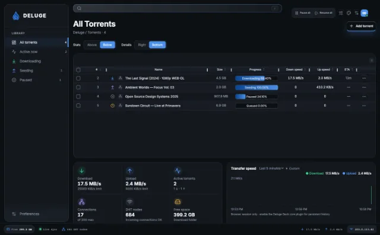
  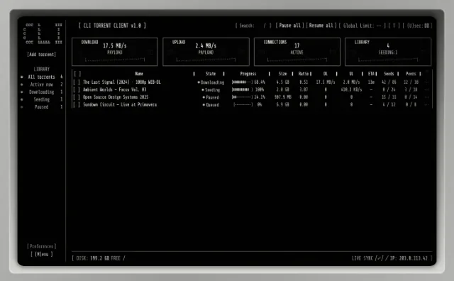
  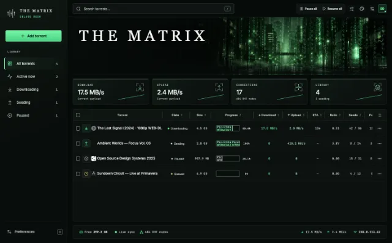
  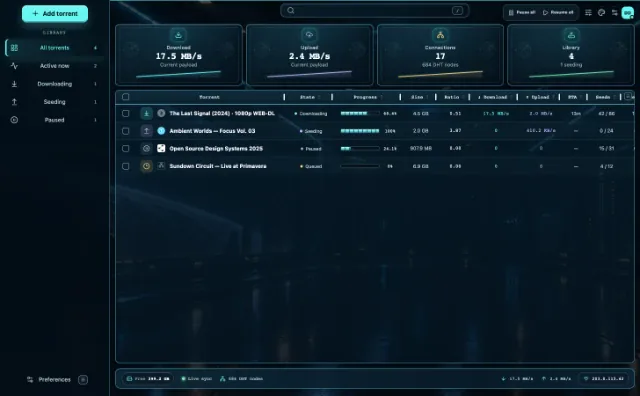
</p>
<p align="center">
  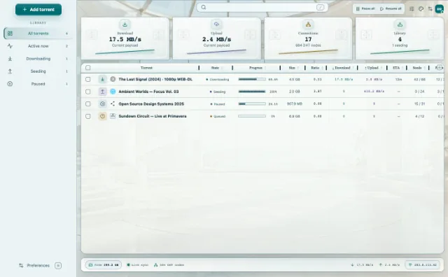
  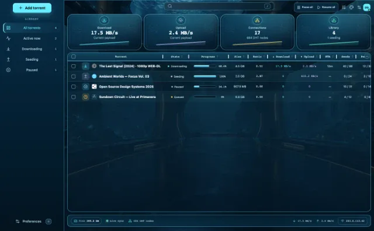
  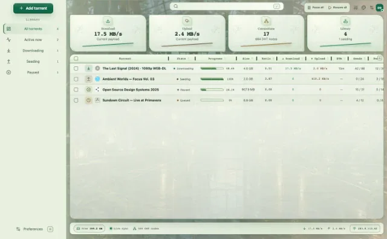
  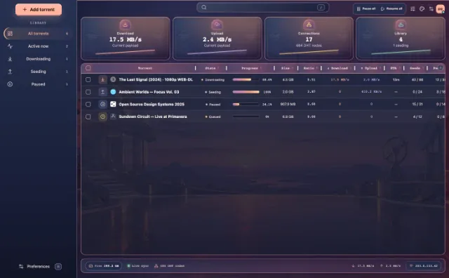
</p>

### Holiday themes

<p align="center">
  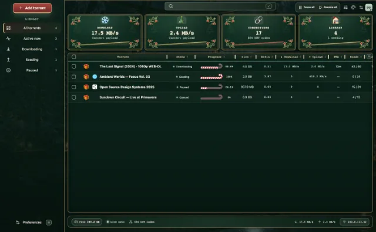
  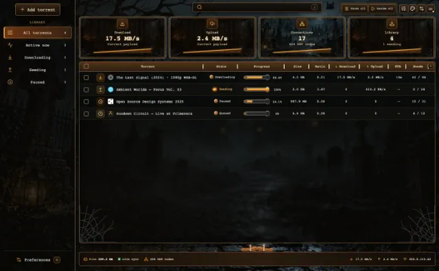
  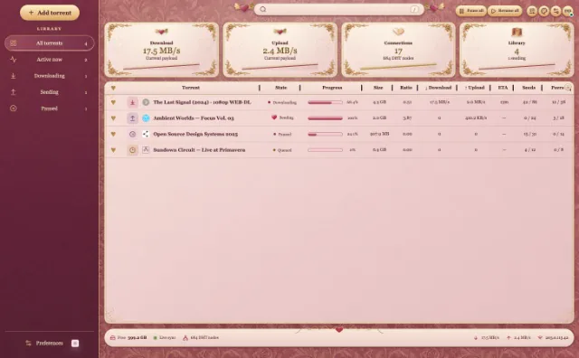
</p>
<p align="center">
  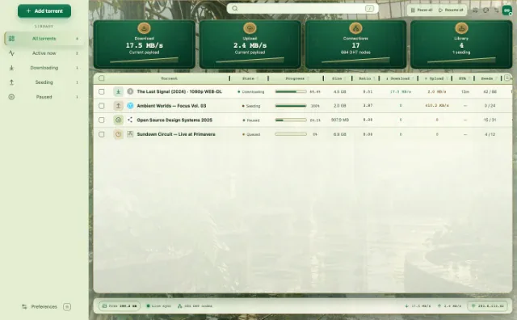
  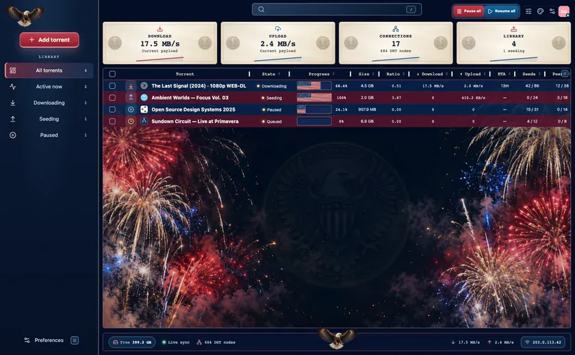
  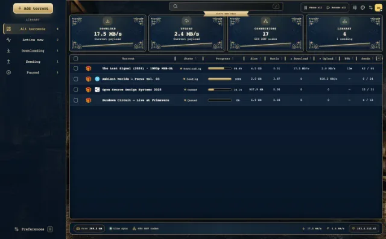
</p>

### Sports themes

One current preview is shown for each sport.

<p align="center">
  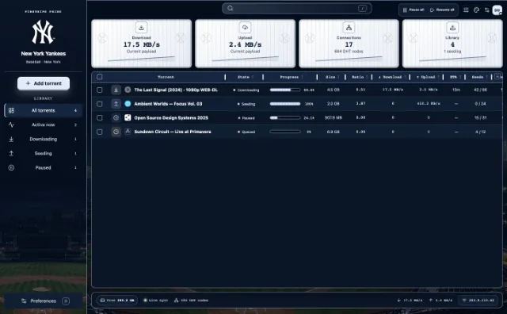
  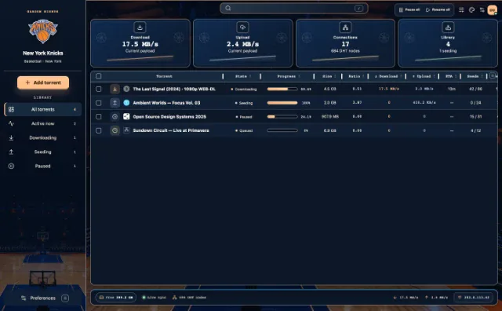
  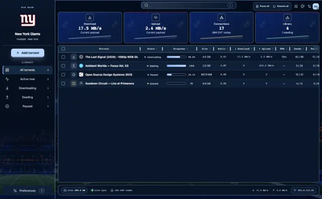
  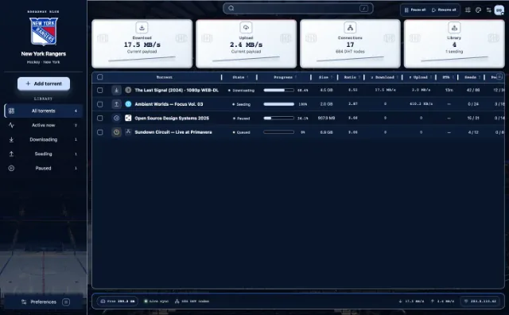
</p>

## Install as a Deluge plugin

1. Download the `.egg` asset from the [latest GitHub release](https://github.com/micro23/deluge-deck/releases/latest).
2. In Deluge, open **Preferences → Plugins → Install Plugin** and select the egg.
3. Enable **DelugeDeck** in Deluge’s plugin settings and restart Deluge if requested.
4. If your Deluge build lists WebUI plugins separately, enable **DelugeDeck** there too, then reload Deluge Web.
5. Open your usual Deluge Web address. The plugin uses that same host, port, password, cookies, and SSL configuration; it does not start another listener.

The egg includes Python source and WebUI assets, with no native extensions or bundled interpreter. CI checks plugin loading against Deluge 2.2 on Python 3.11–3.14. The `py3.14` part of the egg filename identifies the build interpreter; it does not require Python 3.14 at runtime. Deluge 1.x / Python 2 is not supported.

## Run the standalone companion

The companion runs on the machine that can reach Deluge Web. It defaults to `http://127.0.0.1:8118` and connects to Deluge Web at `http://127.0.0.1:8112`.

```sh
npm ci
npm run build
npm start
```

Set `DELUGE_URL` if Deluge Web uses another address. The companion binds to `127.0.0.1` by default. To serve it beyond that machine, configure an authenticated reverse proxy with TLS. Do not expose an unauthenticated instance to the network.

On Windows, install Node.js 20.19+ or 22.12+, run the commands above in PowerShell, or use `start-windows.cmd` after building. Enter your Deluge Web password in Deck’s login screen; it is not written into the repository.

## Explore demo mode

Demo mode runs an in-memory Deluge fixture with fictional torrents; it does not require a Deluge installation or alter a real library.

```sh
npm ci
npm run demo
```

Open [http://127.0.0.1:8118](http://127.0.0.1:8118); demo mode starts with a preconnected fictional session.

## Build the plugin from source

Install Node.js 20.19+ or 22.12+, and Python 3.14. From the repository root:

```sh
npm ci
python3 -m venv .venv-release
.venv-release/bin/python -m pip install -r plugin/build-requirements.txt
PYTHON="$PWD/.venv-release/bin/python" npm run build:plugin
```

The egg and SHA-256 file are written to `plugin/dist/`. Install the resulting egg using the Deluge plugin steps above. See [docs/RELEASE.md](docs/RELEASE.md) for versioning, verification, and publishing details.

## Development and checks

```sh
npm ci
npm run dev       # Vite UI and local service
npm run demo      # standalone fixture service
npm test          # server and UI contract tests
npm run check     # production build and JavaScript checks
```

For a broad theme layout pass, start demo mode and, in another terminal, run `npm run verify:themes`. To focus it on selected themes, set `DECK_VERIFY_THEMES` to their comma-separated IDs, for example `DECK_VERIFY_THEMES=dark,light,ocean,forest,sunset`. `npm run verify:theme-menu` checks theme selection and persistence. After building the plugin, `npm run verify:package-styles` checks the packaged theme CSS at desktop and phone sizes. These browser checks use fictional fixture data. See `package.json` for additional focused browser and performance commands.

The automated checks do not replace testing against the Deluge version and operating system where you plan to use the plugin. Release details and limitations are documented in [docs/RELEASE.md](docs/RELEASE.md).

## Project docs

- [Release procedure and CI checks](docs/RELEASE.md)
- [Darkhand design and history details](docs/DARKHAND-REVIEW.md)
- [Performance review](docs/PERFORMANCE-REVIEW.md)
- [Theme and windowing notes](docs/WINDOWING-AND-THEMES.md)
- [Sports team selection and artwork sources](docs/art/sports-selection.md)

Questions or feedback: micro23@gmail.com
